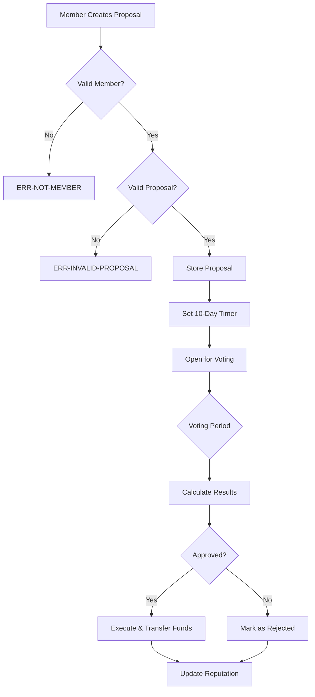

# VelocityDAO ⚡

> **High-Performance Decentralized Governance Engine**  
> Lightning-fast, Bitcoin-secured governance protocol that empowers communities to make decisions at the speed of innovation.

[](https://stacks.co)
[](https://docs.stacks.co/clarity)
[](https://bitcoin.org)
[](LICENSE)

## 🌟 Overview

VelocityDAO revolutionizes decentralized governance by combining the unbreakable security of Bitcoin with the flexibility of smart contracts. Built on Stacks Layer 2, this protocol enables communities to move from idea to execution faster than ever before.

### Key Features

- **⚡ Lightning-Fast Governance**: 10-day proposal lifecycle with instant voting
- **🔒 Bitcoin Security**: Inherits Bitcoin's security through Stacks Layer 2
- **🏆 Reputation System**: Dynamic reputation scoring for enhanced governance
- **💰 Treasury Management**: Automated fund distribution and treasury operations
- **🤝 Cross-DAO Collaboration**: Inter-DAO partnership proposals and execution
- **📊 Weighted Voting**: Stake and reputation-based voting power calculation

## 🏗️ Architecture

### System Overview

```text
┌─────────────────────────────────────────────────────────────┐
│                        VelocityDAO                         │
├─────────────────────────────────────────────────────────────┤
│  ┌─────────────────┐  ┌─────────────────┐  ┌──────────────┐ │
│  │   Membership    │  │   Governance    │  │   Treasury   │ │
│  │   Management    │  │    Engine       │  │  Operations  │ │
│  │                 │  │                 │  │              │ │
│  │ • Join/Leave    │  │ • Proposals     │  │ • Donations  │ │
│  │ • Reputation    │  │ • Voting        │  │ • Funding    │ │
│  │ • Activity      │  │ • Execution     │  │ • Balance    │ │
│  └─────────────────┘  └─────────────────┘  └──────────────┘ │
├─────────────────────────────────────────────────────────────┤
│  ┌─────────────────┐  ┌─────────────────┐  ┌──────────────┐ │
│  │     Staking     │  │ Cross-DAO Collab│  │ Maintenance  │ │
│  │    Mechanism    │  │                 │  │  Functions   │ │
│  │                 │  │ • Partnerships  │  │              │ │
│  │ • Stake STX     │  │ • Proposals     │  │ • Inactivity │ │
│  │ • Unstake       │  │ • Acceptance    │  │ • Decay      │ │
│  │ • Voting Power  │  │ • Management    │  │ • Cleanup    │ │
│  └─────────────────┘  └─────────────────┘  └──────────────┘ │
└─────────────────────────────────────────────────────────────┘
                              │
                              ▼
                    ┌─────────────────┐
                    │  Stacks Layer 2 │
                    │                 │
                    │ • Smart Contract│
                    │ • STX Transfers │
                    │ • Block Heights │
                    └─────────────────┘
                              │
                              ▼
                    ┌─────────────────┐
                    │   Bitcoin L1    │
                    │                 │
                    │ • Final Security│
                    │ • Immutability  │
                    │ • Consensus     │
                    └─────────────────┘
```

### Contract Architecture

The VelocityDAO smart contract is organized into several key modules:

#### Core Data Structures

- **Members Map**: Stores member profiles with reputation, stake, and activity data
- **Proposals Map**: Contains proposal metadata, voting results, and status
- **Votes Map**: Tracks individual voting records to prevent double voting
- **Collaborations Map**: Manages inter-DAO partnership proposals

#### Functional Modules

1. **Membership Management**
   - User onboarding and offboarding
   - Reputation tracking and updates
   - Activity monitoring

2. **Staking Mechanics**
   - STX token locking/unlocking
   - Voting power calculation
   - Treasury integration

3. **Governance Engine**
   - Proposal creation and validation
   - Weighted voting system
   - Automatic execution

4. **Treasury Operations**
   - Fund management
   - Donation handling
   - Balance tracking

## 📊 Data Flow

### Proposal Lifecycle



### Voting Power Calculation

```text
Voting Power = (Reputation × 10) + Staked STX Amount

Where:
- Reputation: Dynamic score based on participation
- Staked STX: Locked tokens showing commitment
- Base reputation starts at 1 for new members
```

## 🚀 Getting Started

### Prerequisites

- [Clarinet](https://docs.hiro.so/clarinet) v2.0+
- [Node.js](https://nodejs.org/) v18+
- [Git](https://git-scm.com/)

### Installation

1. **Clone the repository**

   ```bash
   git clone https://github.com/samuel-dafeta/velocity-dao.git
   cd velocity-dao
   ```

2. **Install dependencies**

   ```bash
   npm install
   ```

3. **Check contract syntax**

   ```bash
   clarinet check
   ```

4. **Run tests**

   ```bash
   npm test
   ```

### Quick Start

1. **Deploy the contract locally**

   ```bash
   clarinet console
   ```

2. **Join the DAO**

   ```clarity
   (contract-call? .velocity-dao join-dao)
   ```

3. **Create a proposal**

   ```clarity
   (contract-call? .velocity-dao create-proposal 
     "Fund Development" 
     "Allocate 1000 STX for new features" 
     u1000000000)
   ```

4. **Vote on proposals**

   ```clarity
   (contract-call? .velocity-dao vote-on-proposal u1 true)
   ```

## 🔧 Usage Examples

### For Members

```clarity
;; Join the DAO
(contract-call? .velocity-dao join-dao)

;; Stake STX tokens
(contract-call? .velocity-dao stake-tokens u500000000) ;; 500 STX

;; Create a funding proposal
(contract-call? .velocity-dao create-proposal
  "Marketing Campaign"
  "Fund Q1 marketing initiatives to grow community"
  u2000000000) ;; 2000 STX

;; Vote on a proposal
(contract-call? .velocity-dao vote-on-proposal u1 true)

;; Check your reputation
(contract-call? .velocity-dao get-member-reputation tx-sender)
```

### For DAOs (Cross-Collaboration)

```clarity
;; Propose collaboration with another DAO
(contract-call? .velocity-dao propose-collaboration
  'ST1PQHQKV0RJXZFY1DGX8MNSNYVE3VGZJSRTPGZGM.other-dao
  u1)

;; Accept collaboration (from partner DAO)
(contract-call? .velocity-dao accept-collaboration u1)
```

## 📋 API Reference

### Public Functions

#### Membership

- `join-dao()` - Join the DAO community
- `leave-dao()` - Leave the DAO and reclaim stake

#### Staking

- `stake-tokens(amount)` - Lock STX tokens for voting power
- `unstake-tokens(amount)` - Withdraw staked STX tokens

#### Governance

- `create-proposal(title, description, amount)` - Submit new proposal
- `vote-on-proposal(proposal-id, vote)` - Cast weighted vote
- `execute-proposal(proposal-id)` - Execute approved proposal

#### Treasury

- `donate-to-treasury(amount)` - Contribute STX to treasury

#### Collaboration

- `propose-collaboration(partner-dao, proposal-id)` - Initiate DAO partnership
- `accept-collaboration(collaboration-id)` - Accept partnership

### Read-Only Functions

- `get-treasury-balance()` - Current treasury balance
- `get-member-reputation(user)` - Member's reputation score
- `get-proposal(proposal-id)` - Proposal details
- `get-member(user)` - Complete member profile
- `get-total-members()` - Active member count
- `get-total-proposals()` - Total proposal count

## 🧪 Testing

The project includes comprehensive test coverage using Vitest and Clarinet SDK.

```bash
# Run all tests
npm test

# Run tests with coverage report
npm run test:report

# Watch mode for development
npm run test:watch
```

### Test Structure

```text
tests/
└── velocity-dao.test.ts    # Comprehensive test suite
    ├── Membership tests
    ├── Staking mechanism tests
    ├── Governance flow tests
    ├── Treasury operation tests
    └── Cross-DAO collaboration tests
```

## 🔒 Security Features

- **Bitcoin Security**: Inherits Bitcoin's proof-of-work security
- **Immutable Contracts**: Deployed contracts cannot be modified
- **Multi-signature Safety**: Requires community consensus for fund transfers
- **Reputation Guards**: Prevents Sybil attacks through reputation system
- **Time-locked Proposals**: 10-day minimum for proposal consideration
- **Vote Prevention**: One vote per member per proposal

## 🛣️ Roadmap

- [x] **Phase 1**: Core governance functionality
- [x] **Phase 2**: Staking and reputation system
- [x] **Phase 3**: Cross-DAO collaboration features
- [ ] **Phase 4**: Mobile-friendly interface
- [ ] **Phase 5**: Advanced analytics dashboard
- [ ] **Phase 6**: Multi-token support

## 🤝 Contributing

We welcome contributions! Please see our [Contributing Guidelines](CONTRIBUTING.md) for details.

1. Fork the repository
2. Create your feature branch (`git checkout -b feature/amazing-feature`)
3. Commit your changes (`git commit -m 'Add amazing feature'`)
4. Push to the branch (`git push origin feature/amazing-feature`)
5. Open a Pull Request

## 📄 License

This project is licensed under the ISC License - see the [LICENSE](LICENSE) file for details.

## 🔗 Links

- [Stacks Documentation](https://docs.stacks.co/)
- [Clarity Language](https://docs.stacks.co/clarity)
- [Clarinet CLI](https://docs.hiro.so/clarinet)
- [Stacks Explorer](https://explorer.stacks.co/)

---

Built with on Stacks | Secured by Bitcoin
